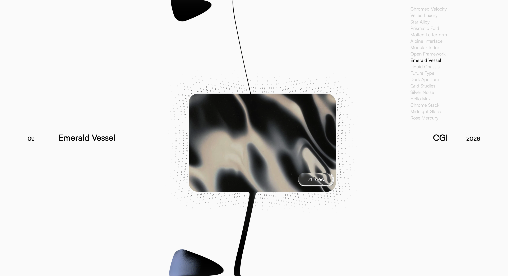

# ICE WORKS

> 一件以“冰的凝结、融化与流动”为视觉隐喻的实验性交互网页作品。

> **说明**：本仓库是 [MegD1/Ice-works-showcase](https://github.com/MegD1/Ice-works-showcase) 的复现部署版本，
> 原作与原始代码版权归原作者所有（MIT，见 [LICENSE](LICENSE)）。
> 本副本仅新增 GitHub Pages 静态导出配置（`output: "export"` + `basePath`）与资源路径前缀。
>
> 在线预览：<https://tiffanydesign.github.io/Ice-works-showcase/>（建议桌面端 Chrome / Edge 访问）
>
> **当前素材**：圆环上的 12 张卡片已换成 PhenomeTech 智能戒指的产品摄影，开场标题为 `PHENOME RING`。
> 交互、着色器与参数均未改动；下文中“冰”的视觉隐喻描述的是原作的美术定位。

[](LICENSE)


ICE WORKS 将后数字极简主义、编辑式排版和生成艺术结合在一个全屏作品轮播中。页面以近白背景、黑色无衬线字体和大面积留白建立冷静秩序，再通过 WebGL 图像、ASCII 粒子、液态连接和玻璃折射打破这份秩序。

它既是一个作品集界面，也是一项关于数字图像如何在“颗粒—凝结—成像—融化—流动”之间转换的视觉实验。



## 风格

**后数字极简主义（Post-digital Minimalism）× 实验性编辑设计。**

- 新瑞士主义排版：无衬线字体、非对称信息布局和大量留白。
- 冰冷未来感：黑白影像、液态金属、玻璃折射和颗粒噪点。
- 生成艺术语言：ASCII 粒子聚合、消散与图像采样。
- 有机数字动效：黏性连接、惯性旋转、流体形变和弹性回正。
- 独立艺术指导气质：适合作品集、时装、字体、音乐与文化项目。

整体气质可以概括为：**克制、冰冷、先锋、实验，同时带有液态生命感。**

## 核心体验

### 粒子凝成图像

开场时，第一张图像以一片四向镜像、棱形对称的 ASCII 粒子云出现。粒子从约 3.8 倍卡片范围向中心收拢，逐渐由抽象颗粒转为图像色彩和明暗，最终凝成一张完整卡片。

卡片短暂停留时，背后仍有一层呼吸式粒子场；卡片开始运动后，粒子反向流出并消失，随后完整圆环展开。开启“减少动态效果”的系统设置时，空间聚合过程会被跳过。

### 黏性作品圆环

12 张横屏作品图像沿一个大部分位于屏幕外的圆环排列。滚轮或拖拽会为圆环增加惯性，停止操作后自动吸附到最近卡位。

卡片并不是 12 个独立 DOM 元素，而是在同一张全屏片元着色器中通过有向距离场绘制。相邻卡片靠近时会黏合，分离时会拉出逐渐变细的液态桥和丝线。

### 悬停粒子阴影

鼠标悬停卡片时，只有当前卡片背后会同步生成一层松散、不规则、非棱形的 ASCII 粒子阴影。粒子跟随卡片的位置、比例和旋转进入；鼠标离开后，粒子沿相反方向退出。

粒子的字形是 PHENOME LONGEVITY 的逐字母拼写（`PHENOMELONGEVITY`，十六格），见 `components/ring/ascii.js`。字形图集有两行，一行当明暗梯度，一行当单词——两者对字号的要求正好相反。

**悬停粒子读的是单词行。**字母按格子自己的列号取字（`mod(列号, 7)`），所以每一行都从 `P` 起、从左到右拼出 `PHENOME`，并在光晕里横向平铺重复；单词行的字母统一字号，因为文字变的是墨量而不是字号。明暗层次交给粒子密度和距离衰减承担。卡片上下沿的光晕顺着文字方向走，单词读起来最完整；左右两侧被向内的漂移把列拧弯，会重新读成质感——这是预期行为。

**入场组装和种子卡光晕读的是梯度行。**着色器按密度索引这个字符集：第 0 格用在粒子场最外缘，最后一格贴着卡片边缘。所以这个顺序决定的是**哪个字母出现在离卡片多远的位置**，画面上并不会读出品牌名——`P` 是最外缘最淡的小点，`Y` 是贴着卡片最重的一笔。

梯度行里字母本身的墨量跨度只有原符号集的五分之一，且品牌顺序下轻重完全不递增，所以九倍的墨量梯度全靠**每个字形单独求解字号**来实现（44px–150px，字格 160px），启动时按当前平台的等宽字体实测反解。

dev 面板 `hover particles` 里的 `spell PHENOME` 可以关掉单词模式，退回原来的梯度效果做对比；`word fill` 控制字母被随机抽稀的程度，`glyph size` 就是字号——七个字母大约要占掉 `reach` 的一半。

大圆环和卡片之间的液态连接始终保持干净，不会被粒子覆盖。

### 编辑式信息系统

当前作品的编号与名称位于左侧，类型与年份位于右侧，完整作品索引固定在右上角。信息会随着圆环旋转同步切换，文字变化使用模糊阈值融合，而未变化的字段保持稳定。

## 交互方式

| 操作 | 结果 |
| --- | --- |
| 滚轮 | 旋转圆环并产生惯性 |
| 鼠标拖拽 | 直接控制旋转方向与速度 |
| 悬停卡片 | 卡片抬升、邻居避让并生成粒子阴影 |
| 点击非中心卡片 | 平滑旋转到正面位置 |

本版本以**桌面端**为主要展示环境，推荐在宽度大于 1024px 的窗口中体验。设计基准视口为 1512 × 870。

## 技术实现

- **Next.js 16 / React 19**：页面结构与组件生命周期。
- **Three.js / GLSL**：全屏 WebGL 渲染、图像图集和片元着色。
- **Signed Distance Field**：卡片轮廓、圆角、黏合与液态桥。
- **GSAP**：开场时间线、圆环展开、文字揭示和交互过渡。
- **ASCII 粒子采样**：根据图像亮度、距离场和时间构建粒子形态。
- **lil-gui**：开发环境中的实时视觉参数调试面板。
- **Tailwind CSS v4**：基础页面样式。

圆环、卡片、液态连接、粒子、玻璃边缘与鼠标标签由同一个 shader pass 计算，因此不同效果能够共享同一套像素、距离与折射信息。

## 本地运行

环境要求：**Node.js 20 或更高版本**。

```bash
git clone https://github.com/MegD1/Ice-works-showcase.git
cd Ice-works-showcase
npm install
npm run dev
```

打开 [http://localhost:3000](http://localhost:3000)。

| 命令 | 用途 |
| --- | --- |
| `npm run dev` | 启动开发服务器 |
| `npm run build` | 创建生产构建 |
| `npm start` | 运行生产构建 |
| `npm run lint` | 执行 ESLint 检查 |

## 自定义内容

作品数据位于 `components/ring/projects.js`：

```js
{
  file: "1.webp",
  name: "Ring Family",
  type: "Product",
  year: "2026"
}
```

将新的横屏图片放入 `public/`，再修改数组中的文件名和作品信息即可。数组长度就是圆环上的卡片数，`params.count` 与图集尺寸都从它读取，增删条目不需要改别处。

推荐使用统一的 **3:2 横屏 WebP**（本项目为 1536×1024）。卡片宽高比锁死在 3:2，`atlas.js` 会按 cover 方式居中裁切，所以纵图请先自行裁好再放进来，否则上下会被切掉。

数组顺序同时决定：

1. 图像图集的打包顺序；
2. 卡片在圆环上的排列顺序；
3. 右上角作品索引顺序；
4. 作品编号。

## 项目结构

```text
app/
  page.js                 页面入口
  globals.css             全局样式与字体

components/
  Carousel.jsx            渲染器、输入、布局与开场时间线
  ring/
    ascii.js              粒子字形图集与密度梯度
    atlas.js              图像图集
    gui.js                开发调试面板
    meta.js               两侧作品信息
    params.js             全部可调参数
    projects.js           作品数据
    splitText.js          开场标题拆字
    tag.js                View 鼠标标签
  shaders/
    planeShaders.js       圆环、粒子、液态与玻璃效果
    textShaders.js        标题字形揭示
```

## 开发调试

开发模式下，页面右上角会出现 lil-gui 参数面板，可以实时调整圆环、舞台、粒子、液态连接、玻璃折射、悬停反馈和开场动效。生产构建不会加载该面板。

调整视觉参数前，建议在 `fit` 分组中确认当前缩放值为 `1.000`，或将当前窗口设为参考尺寸，避免在非基准缩放下得到偏差较大的参数。

## 衍生关系与署名

本仓库是基于 Yousuf Soomro 的 [Viscose Carousel](https://github.com/Yousuf-developer/Viscose-carousel) 制作的**衍生研究版本**。原项目采用 MIT License，原始版权声明已保留在 [LICENSE](LICENSE) 中。

圆环概念、WebGL 基础实现和主要交互方式来自原项目。本版本在其基础上完成了以下调整：

- 更换为统一横屏的黑白、金属和抽象视觉素材；
- 重写作品名称、类型与年份；
- 新增棱形对称的粒子凝图开场；
- 新增中心单卡粒子呼吸与离场效果；
- 新增悬停卡片背后的不规则 ASCII 粒子阴影；
- 扩充开发调试参数与设计说明。

请勿将本项目表述为完全独立于原项目的原创实现。

## 素材与字体说明

### 图像

`public/*.webp` 中的 12 张图像是 PhenomeTech 智能戒指的产品与场景摄影，由项目方提供，用于本页面的交互演示。每张素材对应的原始文件名记录在 `public/image-sources.json`。

这些图片**不受本仓库 MIT License 授权**，版权归素材提供方所有；代码之外的再分发请另行确认。

### 字体

| 字体 | 用途 | 许可说明 |
| --- | --- | --- |
| Satoshi | 项目名称、类型与索引 | Fontshare 免费字体 |
| Geist | 数字、年份与加载计数 | SIL Open Font License |
| PP Neue Montreal | 开场标题与鼠标标签 | 商业字体，仅供本地评估 |

仓库中的 PP Neue Montreal 字体文件不包含在 MIT License 中。用于正式发布或商业项目时，请自行购买授权，或替换为可商用字体。

## 当前限制

- `View` 标签目前只承担交互提示，尚未连接到作品详情页。
- 项目主要针对桌面视口调校，移动端不是本版本的设计重点。
- GLSL 在浏览器运行时编译，因此修改 shader 后除构建检查外，还需要实际打开页面验证。

## License

源代码遵循 [MIT License](LICENSE)。字体文件和 `public/` 内的第三方图像不包含在该许可范围内。

## 致谢

- [Yousuf Soomro](https://github.com/Yousuf-developer) — Viscose Carousel 原始概念与实现。
- [Ashima Arts](https://github.com/ashima/webgl-noise) — GLSL Simplex Noise。
- [GSAP](https://gsap.com/) 与 [Three.js](https://threejs.org/)。
